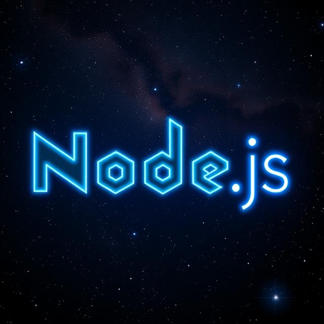

# CATopalian_Node.js_Library
A collection of useful Node.js functions

---

---

For Sync functions click this link [link](src/js/sync/sync.md)  

---

# Async

# File

> ## [writeAsync](src/js/async/file/writeAsync/writeAsync.js)

> ## [readAsync](src/js/async/file/readAsync/readAsync.js)

---

# Disk

[getDiskSpaceAsync](src/js/async/disk/getDiskSpace.js)

---

### How to Download this Library
1. Click the green Code Button on this github page
2. Choose Download ZIP
3. Save the Zip File
4. Extract All
5. Double click the README.md to show the index

---

Happy Scripting :-)

---

//----//

// Dedicated to God the Father  
// All Rights Reserved Christopher Andrew Topalian Copyright 2000-2025  
// https://github.com/ChristopherTopalian  
// https://github.com/ChristopherAndrewTopalian  
// https://sites.google.com/view/CollegeOfScripting

